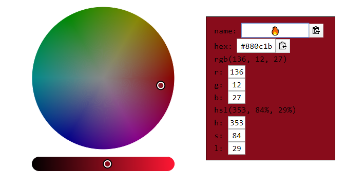
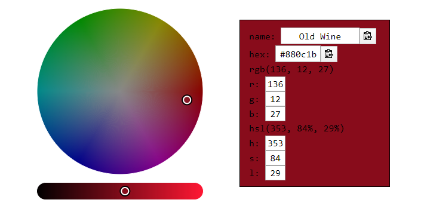

# Swatches

Color scheme generation tool deployed as a web application; built using React.

Integrates with a variety of color libraries to help find the perfect color scheme.

<!-- TOC START min:2 max:3 link:true asterisk:true update:true -->
* [Features](#features)
	* [Unicode Characters to Color Name](#unicode-characters-to-color-name)
* [Built With](#built-with)
* [Contributing](#contributing)
* [License](#license)
<!-- TOC END -->

## Features

### Unicode Characters to Color Name

*Upon input field losing focus, the actual color name displays.*

## Built With

* [React](https://reactjs.org/) - JavaScript UI library.
* [iro.js](https://github.com/jaames/iro.js) - HSV color picker widget for JavaScript.
* [color-names](https://github.com/meodai/color-names) - Crowdsourced color name list.
* [nearest-color](https://github.com/dtao/nearest-color) - Naive NNS implementation to find nearest color from a list of colors.
* [clipboard](https://github.com/zenorocha/clipboard.js) - Modern copy to clipboard.

## Contributing

Please read [CONTRIBUTING.md](https://github.com/mxk5025/swatches/blob/master/CONTRIBUTING.md) for details on our code of conduct, and the process for submitting pull requests to us.

## License

This project is licensed under the MIT License - see the [LICENSE](LICENSE) file for details
